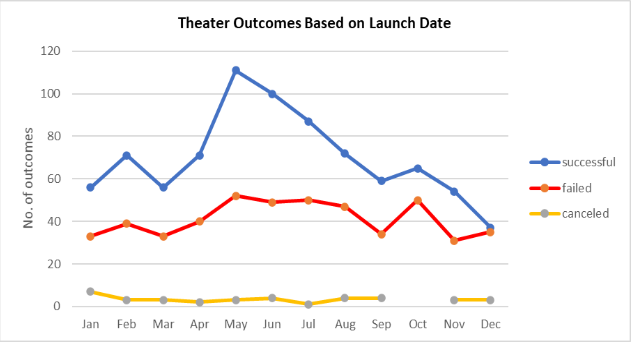
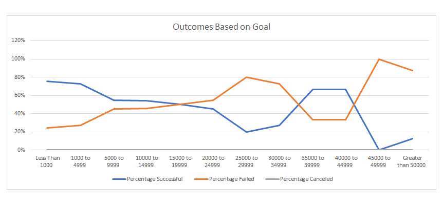

# Analysis of Kikstarter Campaigns

### Overview of Project
The project analyses Kickstarter data from 2010 to 2017 to finds trends and patterns for launching a successful funding campaign for theater plays. 
### Purpose
The purpose of this analysis is to help individuals who are interested in launching a funding campaign for theater plays on Kickstarter. This analysis provides statistics and insights that can be used to make decisions related to funding amounts, launch dates, launch periods to launch a potentially successful campaign.  
### Analysis and Challenges
This analysis was completed using Microsoft Excel and to work with the tool, one needs to download the spreadsheet `Kickstarter_Challenge.xlsx` from this repository and open that in a spreadsheet processing tool.

#### Analysis Methodology
1. Outcomes Based on Launch Date
The first analysis looks at the outcomes of the Kikstarter theater campaigns based on the launch data or more specifically by the launch month. The objective is to see if there are any visible trends when it comes to launching a successful theater play campaign. To complete the analysis:
   -  The dates in the data set were converted from UNIX timestamp to short data type and the year and month were extracted from each date. 
    - Next, the entire Kikstarter dataset was selected in a pivot table with the following selections:
       - `Parent Category` and `Years` as the filter.
       - `outcomes` in the columns and values
       - `Years` in the row labels, adjust the row labels settings so that instead of showing the data per year the data is showed for each month.
    - Next, filter the data based on the 'theater' parent category and plot the resulting pivot table.

2. Outcomes Based on Goals
The second analysis looks at the outcomes of the Kikstarter theater based on the funding goals for the campaigns. To get a better insight into the trends, the goal data was distributed into 11 bins of equal intervals starting from 'less than $1,000' and going to '$50,000 and above'. To complete the analysis:
   - Create bin intervals starting from $1,000 and incrementing by $4,999 going all the way up to $50,000. 
   - Next, use the `COUNTIF` function to find out the total number of successful, failed, and canceled projects for each bin range.
   - Next, calculate the percentage of successful, failed, and canceled projects for each bin range.
   - Plot the percentage of successful failed and canceled data for each bin in a line chart. 

### Challenges and Difficulties Encountered
There are a few challenges that need to be addressed to successfully pivot the data to provide key insights into the theater play data
   - a. Transform the UNIX date types to short date types to extract months and year from the launch dates.
   - b. Grouping the year data in the pivot table to show months of the year rather than the full launch date. 
   - c. Applying `COUNTIFS` function to populate "Number Successful," "Number Failed," and "Number Canceled" columns by filtering on the Kickstarter "outcome" column.

### Results

#### Outcomes by Launch Date
Below is the chart displaying the outcomes of the theater campaigns based on their launch month. There is a clear trend that emerges in front of us. The month of May has the highest number of successful theater campaigns. What can this be attributed to? Maybe the month of May is when a lot of people have summer vacation and consequently more leisure time, which in turn may drive up the demand for theater services. 

Similarly, the month of November and December have the least number of successful plays, which tells us that a lot of campaigns that start in those months do not come to fruition, this maybe can be attributed to people being busy in holiday activities related to Christmas and Thanksgiving and they maybe do not have time or money left over to spend on theater activities.

&nbsp;

&nbsp;

#### Outcomes based on Goals
The chart below shows the outcomes vs. the campaign goal amount. It is a lot more varied than the above chart and it does not provide a clear cut answer. However, overall we can say that campaigns that have a lower campaign goal have a higher chance of being successful. This can be shown by the blue line being above the orange line from < $1,000 to $19,999. 

&nbsp;

&nbsp;

#### Some limitations of this dataset
   - For a more granular analysis, the play sub-category can be divided further into the genre of the play. 
   - The dataset does not have information on the founder of the campaigns. 
   - The dataset has no information on how and where the Kikstarter campaigns were advertised.

#### Additional tables and/or graphs that we could create
   - We can create a pivot chart of outcomes of plays vs the launch date to see if play campaigns follow the same trend that the theater campaigns follow. 
   - We can create a histogram of theater campaigns started each month to see which months are more popular for starting a funding campaign for plays. 
